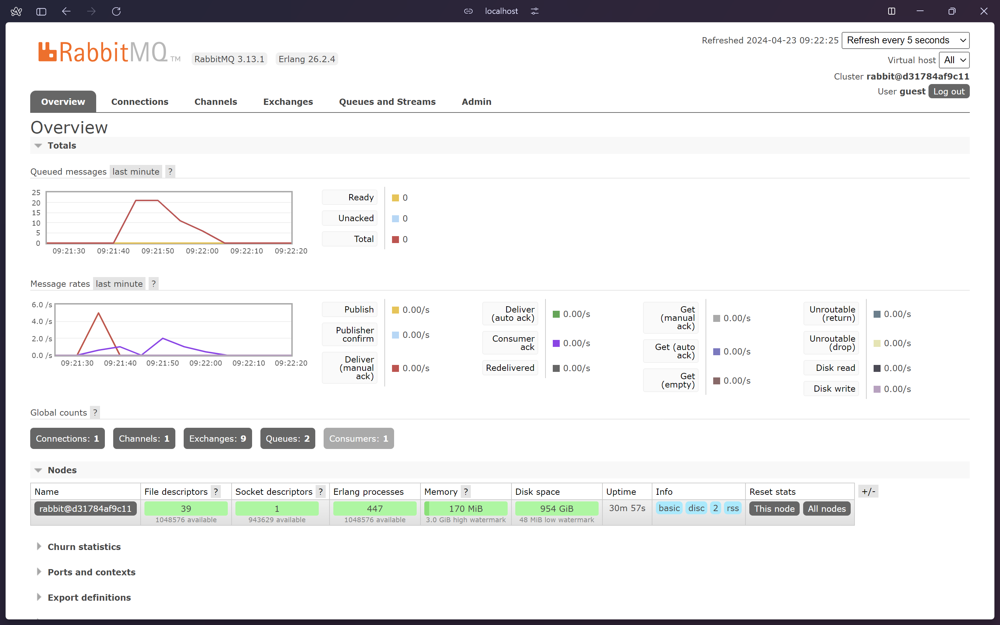

# Modul 8 - Subscriber
**Samuel Farrel Bagasputra - 2206826614 - Adpro C**
  

## What is `amqp`?
`amqp` yaitu AMQP (Advanced Message Queueing Protocol) adalah protokol komunikasi yang digunakan untuk pertukaran pesan antara aplikasi atau organisasi yang berbeda dan memungkinkan aplikasi untuk saling berkomunikasi secara asinkronus. Penerapan AMQP biasanya dibagi menjadi tiga elemen yaitu *Publisher* yang merupakan aplikasi yang mengirimkan pesan, *Broker* yaitu perantara untuk pesan yang dikirimkan antara publisher dan *Customer* yaitu penerima pesan.

## What does `guest:guest@localhost:5672` mean?
`guest:guest@localhost:5672` adalah URI (Uniform Resource Identifier) yang digunakan untuk menentukan alamat broker AMQP

- `guest` pertama adalah username pengguna yang digunakan untuk autentikasi ke broker
- `guest` kedua adalah password/kata sandi pengguna yang digunakan untuk autentikasi ke broker
- `localhost:5672` adalah menyatakan alamat host dan port yang digunakan untuk koneksi ke broker AMQP

## RabbitMQ as message broker
### Simulating Slow Subscriber

Dengan mensimulasikan slow subscriber dan coba menjalankan publisher beberapa kali dalam waktu yang singkat, queued message meningkat hingga 20 messages. Mengapa ini terjadi? Karena subscriber tidak dapat menerima message yang dikirimkan oleh publisher dengan cepat (karena terdapat jeda yang disimulasikan oleh `thread::sleep`), sehingga message yang dikirimkan oleh publisher akan ditampung di dalam queue sampai subscriber dapat menerimanya.